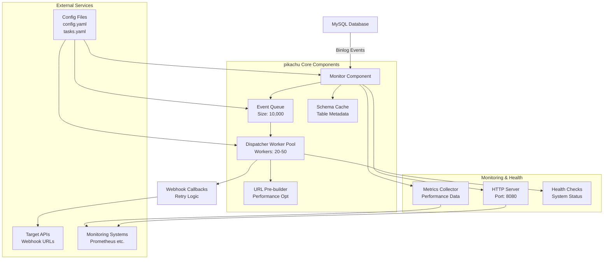

# 🚀 pikachu - MySQL 变更监控工具

<p align="center">
  <strong>一个高效、可靠的 MySQL 数据库变更捕获(CDC)工具</strong><br>
  <sub>实时监控数据库变更，支持高并发 webhook 分发</sub>
</p>

<p align="center">
  <a href="https://github.com/tiyee/pikachu">
    
  </a>
  <a href="https://github.com/tiyee/pikachu">
    
  </a>
  <a href="https://github.com/tiyee/pikachu">
    
  </a>
  <a href="https://github.com/tiyee/pikachu">
    
  </a>
  <a href="https://github.com/tiyee/pikachu">
    
  </a>
  <a href="https://github.com/tiyee/pikachu">
    
  </a>
</p>

pikachu 是一个基于 Go 语言开发的高效 MySQL 数据库变更捕获(CDC)工具。它通过解析 MySQL 的 binlog 日志来实时捕获数据库表的变更事件（插入、更新、删除），并将这些变更通过 webhook 的方式发送到指定的回调地址。

## ⚡ 性能指标

| 指标 | 数值 | 说明 |
|------|------|------|
| **事件处理延迟** | < 10ms | P99 延迟，从 binlog 到 webhook 发送 |
| **吞吐量** | 10,000+ events/sec | 单实例处理能力 |
| **Webhook 成功率** | > 99.9% | 包含重试机制的整体成功率 |
| **内存占用** | < 100MB | 基础运行内存（不含事件队列） |
| **CPU 使用率** | < 5% | 正常负载下的 CPU 占用 |
| **并发处理** | 50+ workers | 可配置的 webhook 并发数 |

## ✨ 核心特性

### 🎯 监控能力
- **实时监控**: 毫秒级延迟的数据库变更捕获
- **全事件支持**: 支持 INSERT、UPDATE、DELETE 事件监控
- **多表监控**: 同时监控多个数据表，独立配置回调
- **精确过滤**: 基于表名和事件类型的精确过滤

### 🚀 性能与可靠性
- **高并发处理**: 基于协程池的并发 webhook 分发
- **智能重试**: 指数退避重试机制，确保消息不丢失
- **性能优化**: URL 预构建，避免运行时重复计算
- **内存效率**: 事件队列缓冲，支持流量突发处理

### 🛠️ 易用性与兼容性
- **配置灵活**: YAML 配置文件，支持多环境部署
- **MySQL 兼容**: 自动处理 MySQL 关键字表名
- **健康检查**: 内置 HTTP 监控端点
- **优雅关闭**: 支持优雅关闭，确保事件处理完成

### 🐳 部署友好
- **Docker 支持**: 提供 Docker 和 Docker Compose 部署方案
- **结构化日志**: 支持 JSON 格式日志，便于日志收集
- **轻量级**: 单一二进制文件部署，无外部依赖

## 📋 系统要求

### 最低要求
- **Go**: 1.25+ (如果从源码编译)
- **MySQL**: 5.6+ 或 MariaDB 10.0+（需要开启二进制日志）
- **内存**: 最少 128MB，推荐 512MB+
- **磁盘**: 最少 50MB 可用空间

### 推荐配置
- **CPU**: 2+ 核心（高并发场景）
- **内存**: 1GB+ （生产环境）
- **网络**: 稳定的数据库连接和 webhook 回调网络

## 🏗️ 架构设计



### 🔄 事件处理流程

1. **Binlog 监听**: Monitor 组件通过 canal 库监听 MySQL binlog 事件
2. **事件过滤**: 根据任务配置过滤表名和事件类型
3. **队列缓冲**: 事件进入高内存队列，支持流量突发
4. **并发分发**: Worker Pool 并发处理 webhook 请求
5. **重试机制**: 失败请求采用指数退避重试策略
6. **状态监控**: 实时收集和暴露系统指标

### 🎯 设计亮点

- **事件驱动架构**: 非阻塞式事件处理，支持高并发
- **内存优化**: 对象池和 JSON 缓存，减少 GC 压力
- **智能重试**: 指数退避算法，避免对下游服务造成压力
- **URL 预构建**: 启动时预构建所有回调 URL，提升运行时性能
- **MySQL 关键字处理**: 自动识别和转义 MySQL 保留字表名

## 🚀 快速开始

### 📦 安装方式

#### 方式一：从源码编译

```bash
# 克隆仓库
git clone https://github.com/tiyee/pikachu.git
cd pikachu

# 编译应用
go build -o pikachu .

# 或使用 Makefile（推荐）
make build
```

#### 方式二：预编译二进制文件

```bash
# 下载对应平台的二进制文件
wget https://github.com/tiyee/pikachu/releases/latest/download/pikachu-linux-amd64.tar.gz

# 解压
tar -xzf pikachu-linux-amd64.tar.gz

# 赋予执行权限
chmod +x pikachu
```

#### 方式三：使用 Docker

```bash
# 拉取镜像
docker pull pikachu:latest

# 或使用 Docker Compose（推荐）
docker-compose up -d
```

#### ⚙️ 配置文件

1. **主配置文件** (`config.yaml`)：

```yaml
# 数据库配置
database:
  host: "localhost"
  port: 3306
  user: "root"
  password: "password"
  database: "test_db"
  server_id: 100  # 唯一标识，避免与主从复制冲突
  charset: "utf8mb4"  # 可选，默认 utf8mb4

# 日志配置
log:
  level: "info"  # debug, info, warn, error, fatal, panic
  format: "text" # text, json

# HTTP 服务器配置
server:
  enabled: true    # 是否启用健康检查服务器
  port: 8080       # 服务器端口
  path: "/health"  # 健康检查路径

# 分发器配置 (性能优化)
dispatcher:
  worker_count: 20         # 工作协程数量 (推荐: CPU核心数 * 2)
  queue_size: 1000         # 队列大小 (支持突发流量)
  timeout: 30s             # HTTP请求超时
  max_retries: 3           # 最大重试次数
  retry_base_delay: 5s     # 重试基础延迟 (最小3s)
  max_connections: 100     # 最大连接数

# 监控器配置
monitor:
  event_queue_size: 10000  # 事件队列大小 (高负载优化)
  event_queue_timeout: 2s  # 事件队列超时时间 (快速响应)

# 可选：回调主机地址（用于相对路径的回调URL）
callback_host: "http://localhost:3000"
```

2. **任务配置文件** (`tasks.yaml`)：

```yaml
tasks:
# 基础示例：监控用户表所有变更
- task_id: "user_monitor"
  name: "用户表变更监控"
  table_name: "users"
  events: ["insert", "update", "delete"]
  callback_url: "/webhook/user"  # 相对路径

# 高级示例：只监控订单表的插入和更新
- task_id: "order_monitor"
  name: "订单表变更监控"
  table_name: "orders"
  events: ["insert", "update"]  # 不监控删除事件
  callback_url: "https://api.example.com/webhook/order"  # 绝对路径

# 特殊表名示例：MySQL关键字表名
- task_id: "keyword_table_monitor"
  name: "关键字表名监控"
  table_name: "order"  # 'order' 是MySQL关键字，系统自动处理
  events: ["insert", "update", "delete"]
  callback_url: "/webhook/order"

# 复杂表名示例：特殊字符和数字开头
- task_id: "complex_table_monitor"
  name: "复杂表名监控"
  table_name: "2024_user-activity_log"  # 包含连字符和数字开头
  events: ["insert"]
  callback_url: "/webhook/activity"

# 生产环境示例：外部API回调
- task_id: "production_sync"
  name: "生产环境数据同步"
  table_name: "sync_data"
  events: ["update"]
  callback_url: "https://external-api.company.com/v1/sync"
```

3. **环境特定配置**：

**开发环境** (`config.dev.yaml`)：
```yaml
log:
  level: "debug"
  format: "text"

dispatcher:
  worker_count: 2
  queue_size: 50

monitor:
  event_queue_size: 100
```

**生产环境** (`config.prod.yaml`)：
```yaml
log:
  level: "warn"
  format: "json"

dispatcher:
  worker_count: 10
  queue_size: 500
  timeout: 60s
  max_retries: 5

monitor:
  event_queue_size: 2000
```

#### 运行

```bash
# 使用默认配置
./pikachu -config config.yaml

# 使用测试环境配置
./pikachu -config config.test.yaml

# 使用生产环境配置
./pikachu -config config.prod.yaml
```

### 使用 Docker 运行

#### 准备配置文件

确保 `config.yaml` 和 `tasks.yaml` 文件已正确配置。

#### 启动服务

```bash
docker-compose up -d
```

## 配置说明

### 数据库配置

| 字段 | 类型 | 必填 | 说明 |
|------|------|------|------|
| host | string | 是 | MySQL 主机地址 |
| port | int | 是 | MySQL 端口 |
| user | string | 是 | MySQL 用户名 |
| password | string | 是 | MySQL 密码 |
| database | string | 是 | 数据库名称 |
| server_id | uint32 | 是 | 用于 binlog 同步的唯一 server ID |
| charset | string | 否 | 字符集，默认为 utf8mb4 |

### 日志配置

| 字段 | 类型 | 必填 | 说明 |
|------|------|------|------|
| level | string | 否 | 日志级别：debug, info, warn, error, fatal, panic (默认: info) |
| format | string | 否 | 日志格式：text, json (默认: text) |

### 服务器配置

| 字段 | 类型 | 必填 | 说明 |
|------|------|------|------|
| enabled | bool | 否 | 是否启用健康检查服务器 (默认: false) |
| port | int | 否 | 服务器端口 (默认: 8080) |
| path | string | 否 | 健康检查路径 (默认: /health) |

### 分发器配置

| 字段 | 类型 | 必填 | 说明 |
|------|------|------|------|
| worker_count | int | 否 | 工作协程数量 (默认: 5) |
| queue_size | int | 否 | 队列大小 (默认: 100) |
| timeout | duration | 否 | HTTP请求超时时间 (默认: 30s) |
| max_retries | int | 否 | 最大重试次数 (默认: 3) |
| retry_base_delay | duration | 否 | 重试基础延迟 (默认: 10s，最小: 3s*) |

***注意**: 如果设置了 `max_retries > 0`，则 `retry_base_delay` 不能小于 3 秒，以避免对目标服务造成过大压力。

### 监控器配置

| 字段 | 类型 | 必填 | 说明 |
|------|------|------|------|
| event_queue_size | int | 否 | 事件队列大小 (默认: 1000) |
| event_queue_timeout | duration | 否 | 事件队列超时时间 (默认: 5s) |

### 任务配置

| 字段 | 类型 | 必填 | 说明 |
|------|------|------|------|
| task_id | string | 是 | 任务唯一标识 |
| name | string | 是 | 任务名称 |
| table_name | string | 是 | 要监控的表名（支持MySQL关键字） |
| events | []string | 是 | 要监控的事件类型 (insert/update/delete) |
| callback_url | string | 是 | webhook 回调地址（支持相对路径和绝对路径） |

### 回调主机配置

| 字段 | 类型 | 必填 | 说明 |
|------|------|------|------|
| callback_host | string | 否 | 回调主机地址，用于拼接相对路径的回调URL |

## 多环境配置

pikachu 支持配置文件分离，便于多环境部署：

### 配置文件结构

- **主配置文件**：
  - `config.yaml` - 默认环境配置
  - `config.prod.yaml` - 生产环境配置
  - `config.test.yaml` - 测试环境配置

- **任务配置文件**：
  - `tasks.yaml` - 任务配置（所有环境共享）
  - `tasks-example.yaml` - 任务配置示例

### 环境配置差异

**生产环境特点**：
- 日志级别：warn
- 日志格式：json
- 更高的性能参数（更多工作协程、更大队列）
- 更长的超时和重试设置

**测试环境特点**：
- 日志级别：debug
- 日志格式：text
- 较低的性能参数（较少工作协程、较小队列）
- 较短的超时和重试设置

## 工作原理

1. **配置加载**: 启动时加载并验证配置文件
2. **权限检查**: 检查数据库连接和必要权限
3. **初始化组件**: 初始化监控器、分发器和事件队列
4. **URL预构建**: 在初始化时预构建所有回调URL，提升运行时性能
5. **事件监听**: 监控器通过 canal 监听 MySQL binlog 事件
6. **事件处理**: 捕获的变更事件通过事件队列传递给分发器
7. **Webhook 发送**: 分发器将事件以 webhook 形式发送到指定地址
8. **健康检查**: 提供 HTTP 健康检查和系统状态监控
9. **优雅关闭**: 支持优雅关闭，确保事件处理完成

## 权限要求

MySQL 用户需要以下权限：
- SELECT - 用于查询表结构
- REPLICATION SLAVE - 用于读取二进制日志
- REPLICATION CLIENT - 用于获取复制状态信息

## MySQL 配置要求

确保 MySQL 服务器已正确配置：
- 开启二进制日志：`log_bin=ON`
- 设置二进制日志格式为 ROW：`binlog_format=ROW`
- 确保 `server_id` 已设置（全局唯一）

## Webhook 数据格式

发送到回调地址的数据格式如下：

```json
{
  "primary_id": 1,
  "event": "insert",
  "table": "users",
  "data": {
    "id": 1,
    "name": "John Doe",
    "email": "john@example.com"
  },
  "timestamp": "2023-01-01T12:00:00Z"
}
```

根据不同事件类型，数据格式略有不同：

- **INSERT**: 包含 `data` 字段，表示新插入的数据
- **UPDATE**: 包含 `old_data` 和 `new_data` 字段，分别表示更新前后的数据
- **DELETE**: 包含 `data` 字段，表示被删除的数据

## 🏥 健康检查与监控

pikachu 提供了完整的 HTTP 监控端点：

### 🔍 健康检查端点

**端点**: `GET http://<host>:<port>/health`

**响应示例**:
```json
{
  "status": "UP",
  "monitor_running": true,
  "dispatcher_running": true,
  "event_queue_size": 0,
  "last_event_time": "2023-05-15T10:30:45Z",
  "uptime": "2h45m30s",
  "version": "v1.0.0"
}
```

**状态说明**:
- `UP`: 系统正常运行
- `DOWN`: 系统出现异常
- `monitor_running`: 监控器是否正在运行
- `dispatcher_running`: 分发器是否正在运行
- `event_queue_size`: 当前事件队列中的待处理事件数量
- `last_event_time`: 最后一次接收到事件的时间
- `uptime`: 服务运行时间
- `version`: pikachu 版本号

### 📊 系统指标端点

**端点**: `GET http://<host>:<port>/metrics`

**响应示例**:
```json
{
  "system": {
    "goroutines": 15,
    "memory_alloc": "2.5MB",
    "memory_total": "15.2MB",
    "gc_cycles": 42
  },
  "monitor": {
    "status": "running",
    "tables_monitored": 5,
    "total_events_processed": 10250,
    "events_per_second": 12.5,
    "last_event_time": "2023-05-15T10:30:45Z",
    "binlog_position": {
      "file": "mysql-bin.000123",
      "position": 456789
    }
  },
  "dispatcher": {
    "status": "running",
    "workers_active": 3,
    "workers_total": 5,
    "queue_size": 0,
    "queue_capacity": 100,
    "webhooks_sent": 10245,
    "webhooks_failed": 5,
    "success_rate": 99.95,
    "avg_response_time": "125ms"
  },
  "tasks": [
    {
      "task_id": "user_monitor",
      "table_name": "users",
      "events_processed": 5230,
      "last_processed": "2023-05-15T10:30:42Z",
      "status": "active"
    },
    {
      "task_id": "order_monitor",
      "table_name": "orders",
      "events_processed": 5020,
      "last_processed": "2023-05-15T10:30:45Z",
      "status": "active"
    }
  ]
}
```

### 🔧 API 响应码说明

| 状态码 | 说明 |
|--------|------|
| 200 | 请求成功 |
| 400 | 请求参数错误 |
| 404 | 端点不存在 |
| 500 | 服务器内部错误 |
| 503 | 服务不可用 |

## 日志说明

程序使用结构化日志记录关键操作和错误信息：

- 支持多种日志级别，可根据需要调整详细程度
- 支持文本和 JSON 两种日志格式
- 日志记录包含时间戳、日志级别、消息和相关字段信息
- 使用 Docker 部署时，日志默认存储在宿主机的 `/data/logs/pikachu` 目录

## 特殊表名支持

pikachu 自动处理各种特殊表名，包括：

### MySQL 关键字表名
```yaml
- task_id: "order_monitor"
  table_name: "order"  # 'order' 是MySQL关键字，系统自动处理
```

### 特殊字符表名
```yaml
- task_id: "special_table_monitor"
  table_name: "my-table"  # 包含连字符，系统自动处理
```

### 数字开头表名
```yaml
- task_id: "numeric_table_monitor"
  table_name: "2024_orders"  # 以数字开头，系统自动处理
```

系统会自动为所有表名添加反引号，确保SQL语句的正确性，无需用户手动处理。

## 性能优化

- **URL预构建优化**: 在初始化时预构建所有回调URL，避免运行时重复计算
- **关键字处理优化**: 使用高效的反引号包围策略处理MySQL关键字表名

## 🐳 Docker 部署指南

### 📋 部署架构

pikachu 采用多阶段构建策略：

- **编译阶段**: Go 1.25-alpine 构建环境
- **运行阶段**: 轻量级 alpine 运行环境
- **安全特性**: 非 root 用户运行，最小权限原则
- **证书支持**: 预装 ca-certificates 支持 HTTPS

### 🚀 快速部署

**方式一：Docker Compose（推荐）**

```bash
# 1. 克隆项目
git clone https://github.com/tiyee/pikachu.git
cd pikachu

# 2. 配置环境变量
cp config-example.yaml config.yaml
cp tasks-example.yaml tasks.yaml

# 3. 编辑配置文件
vim config.yaml  # 配置数据库连接等信息
vim tasks.yaml    # 配置监控任务

# 4. 启动服务
docker-compose up -d

# 5. 查看日志
docker-compose logs -f pikachu
```

**方式二：单独使用 Docker**

```bash
# 1. 构建镜像
docker build -t pikachu:latest .

# 2. 创建数据卷
docker volume create pikachu-logs
docker volume create pikachu-config

# 3. 运行容器
docker run -d \
  --name pikachu \
  -p 8080:8080 \
  -v $(pwd)/config.yaml:/app/config.yaml:ro \
  -v $(pwd)/tasks.yaml:/app/tasks.yaml:ro \
  -v pikachu-logs:/app/logs \
  pikachu:latest
```

### ⚙️ 生产环境部署

**Docker Compose 生产配置**:

```yaml
version: '3.8'

services:
  pikachu:
    image: pikachu:latest
    container_name: pikachu-prod
    restart: unless-stopped

    # 环境变量
    environment:
      - TZ=Asia/Shanghai

    # 端口映射
    ports:
      - "8080:8080"

    # 卷挂载
    volumes:
      - ./config.prod.yaml:/app/config.yaml:ro
      - ./tasks.yaml:/app/tasks.yaml:ro
      - /data/logs/pikachu:/app/logs
      - /etc/localtime:/etc/localtime:ro

    # 资源限制
    deploy:
      resources:
        limits:
          memory: 512M
          cpus: '0.5'
        reservations:
          memory: 128M
          cpus: '0.1'

    # 健康检查
    healthcheck:
      test: ["CMD", "wget", "--no-verbose", "--tries=1", "--spider", "http://localhost:8080/health"]
      interval: 30s
      timeout: 10s
      retries: 3
      start_period: 40s

    # 网络配置
    networks:
      - pikachu-network

    # 日志配置
    logging:
      driver: "json-file"
      options:
        max-size: "10m"
        max-file: "3"

networks:
  pikachu-network:
    driver: bridge
```

### 🔧 Kubernetes 部署

**Deployment 配置**:

```yaml
apiVersion: apps/v1
kind: Deployment
metadata:
  name: pikachu
  namespace: monitoring
  labels:
    app: pikachu
spec:
  replicas: 2
  selector:
    matchLabels:
      app: pikachu
  template:
    metadata:
      labels:
        app: pikachu
    spec:
      containers:
      - name: pikachu
        image: pikachu:latest
        ports:
        - containerPort: 8080
          name: http
        env:
        - name: TZ
          value: "Asia/Shanghai"
        volumeMounts:
        - name: config
          mountPath: /app/config.yaml
          subPath: config.yaml
          readOnly: true
        - name: config
          mountPath: /app/tasks.yaml
          subPath: tasks.yaml
          readOnly: true
        - name: logs
          mountPath: /app/logs
        resources:
          requests:
            memory: "128Mi"
            cpu: "100m"
          limits:
            memory: "512Mi"
            cpu: "500m"
        livenessProbe:
          httpGet:
            path: /health
            port: 8080
          initialDelaySeconds: 30
          periodSeconds: 10
        readinessProbe:
          httpGet:
            path: /health
            port: 8080
          initialDelaySeconds: 5
          periodSeconds: 5
      volumes:
      - name: config
        configMap:
          name: pikachu-config
      - name: logs
        emptyDir: {}

---
apiVersion: v1
kind: Service
metadata:
  name: pikachu-service
  namespace: monitoring
spec:
  selector:
    app: pikachu
  ports:
  - protocol: TCP
    port: 80
    targetPort: 8080
    name: http
  type: ClusterIP
```

### 📊 性能调优

#### 🎯 环境配置优化

**开发环境**:
```yaml
log:
  level: "debug"
  format: "text"

dispatcher:
  worker_count: 2
  queue_size: 50
  timeout: 10s

monitor:
  event_queue_size: 100
```

**生产环境**:
```yaml
log:
  level: "warn"
  format: "json"

dispatcher:
  worker_count: 10-20  # 根据 CPU 核心数调整
  queue_size: 500-1000  # 根据内存容量调整
  timeout: 60s
  max_retries: 5

monitor:
  event_queue_size: 2000-5000
```

#### 🚀 高负载优化

```yaml
# 高并发场景配置
dispatcher:
  worker_count: 50        # 更多工作协程
  queue_size: 2000       # 更大的队列
  timeout: 120s          # 更长的超时时间
  max_retries: 10        # 更多重试次数
  retry_base_delay: 30s  # 更长的重试间隔

monitor:
  event_queue_size: 10000  # 更大的事件队列
```

#### 💾 资源监控

**关键指标**:
- 事件处理延迟（目标：< 100ms）
- Webhook 成功率（目标：> 99.9%）
- 队列使用率（目标：< 80%）
- 内存使用量
- CPU 使用率

## 常见问题与排查

### 连接 MySQL 失败
- 检查数据库连接配置是否正确
- 验证 MySQL 用户权限是否满足要求
- 确认 MySQL 服务器是否开启了二进制日志
- 检查 MySQL 服务器网络连接是否正常

### 事件未触发
- 检查监控的表名是否正确
- 确认配置的事件类型（insert/update/delete）是否正确
- 验证 MySQL 二进制日志格式是否为 ROW
- 检查是否有数据变更发生

### Webhook 回调失败
- 检查回调 URL 是否可访问
- 查看日志中的错误信息
- 确认网络连接和防火墙设置
- 检查回调服务是否正常运行

### 配置文件问题
- 确认 `tasks.yaml` 文件存在且格式正确
- 检查配置文件语法是否正确
- 查看启动日志中的配置加载信息

## 迁移指南

### 从旧版本迁移

1. **备份现有配置**
```bash
cp config.yaml config.yaml.backup
```

2. **提取任务配置**
从现有的 `config.yaml` 中复制 `tasks` 部分到新的 `tasks.yaml` 文件

3. **更新主配置文件**
从 `config.yaml` 中移除 `tasks` 部分

4. **验证配置**
```bash
./pikachu -config config.yaml
```

新版本保持向后兼容，如果 `tasks.yaml` 不存在，系统会尝试从主配置文件中加载任务配置。

## 开发与测试

### 运行测试
```bash
go test ./...
```

### 运行基准测试
```bash
go test -bench=. ./...
```

### 构建生产版本
```bash
go build -ldflags="-s -w" -o pikachu .
```

## 🎯 实际使用场景

### 场景一：微服务数据同步
```yaml
# 用户服务 -> 订单服务 数据同步
tasks:
- task_id: "user_sync_to_order"
  name: "用户信息同步到订单服务"
  table_name: "users"
  events: ["update"]  # 只同步用户信息变更
  callback_url: "https://order-service.internal/api/user-updates"

- task_id: "profile_sync_to_notification"
  name: "用户资料同步到通知服务"
  table_name: "user_profiles"
  events: ["insert", "update"]
  callback_url: "/api/sync/user-profile"  # 相对路径，使用 callback_host
```

### 场景二：搜索引擎索引更新
```yaml
# 商品表变更 -> Elasticsearch 索引更新
tasks:
- task_id: "product_index_update"
  name: "商品搜索引擎索引更新"
  table_name: "products"
  events: ["insert", "update", "delete"]
  callback_url: "https://search-service.internal/index/product"

- task_id: "category_index_update"
  name: "分类索引更新"
  table_name: "product_categories"
  events: ["insert", "update", "delete"]
  callback_url: "https://search-service.internal/index/category"
```

### 场景三：审计日志记录
```yaml
# 敏感操作审计日志
tasks:
- task_id: "financial_audit"
  name: "财务操作审计"
  table_name: "financial_transactions"
  events: ["insert", "update", "delete"]
  callback_url: "https://audit-service.internal/log/financial"

- task_id: "user_action_audit"
  name: "用户操作审计"
  table_name: "user_action_logs"
  events: ["insert"]
  callback_url: "https://audit-service.internal/log/user-actions"
```

### 场景四：缓存失效通知
```yaml
# 数据变更 -> Redis 缓存失效
tasks:
- task_id: "cache_invalidation"
  name: "缓存失效通知"
  table_name: "user_preferences"
  events: ["update", "delete"]
  callback_url: "https://cache-service.internal/invalidate/user"

- task_id: "product_cache_invalidation"
  name: "商品缓存失效"
  table_name: "products"
  events: ["update", "delete"]
  callback_url: "https://cache-service.internal/invalidate/product"
```

### 场景五：实时数据推送
```yaml
# 实时通知 -> WebSocket 服务
tasks:
- task_id: "realtime_notification"
  name: "实时数据推送"
  table_name: "notifications"
  events: ["insert"]
  callback_url: "https://websocket-service.internal/push/notification"

- task_id: "order_status_update"
  name: "订单状态实时推送"
  table_name: "order_status_history"
  events: ["insert"]
  callback_url: "https://websocket-service.internal/push/order-status"
```

### 场景六：数据仓库同步
```yaml
# OLTP -> OLAP 数据同步
tasks:
- task_id: "data_warehouse_sync"
  name: "数据仓库同步"
  table_name: "sales_transactions"
  events: ["insert", "update"]
  callback_url: "https://data-warehouse.internal/api/sync/sales"

- task_id: "analytics_sync"
  name: "分析数据同步"
  table_name: "user_behavior_events"
  events: ["insert"]
  callback_url: "https://analytics-service.internal/api/events"
```

### 场景七：复杂业务流程触发
```yaml
# 业务流程自动化触发
tasks:
- task_id: "order_workflow"
  name: "订单工作流触发"
  table_name: "orders"
  events: ["insert", "update"]
  callback_url: "https://workflow-service.internal/trigger/order-process"

- task_id: "inventory_restock"
  name: "库存补货触发"
  table_name: "inventory"
  events: ["update"]
  callback_url: "https://inventory-service.internal/trigger/restock"
```

## 📝 更新日志

### v1.0.0 (2024-01-15)
#### 🎉 新功能
- ✨ 支持 MySQL 5.6+ 和 MariaDB 10.0+
- ✨ 实时 binlog 事件捕获
- ✨ 灵活的 webhook 回调配置
- ✨ 多环境配置支持
- ✨ 健康检查和监控端点
- ✨ Docker 和 Kubernetes 部署支持

#### 🚀 性能优化
- ⚡ URL 预构建优化
- ⚡ 协程池并发处理
- ⚡ 智能重试机制
- ⚡ 事件队列缓冲

#### 🛠️ 技术特性
- 🔧 自动处理 MySQL 关键字表名
- 🔧 结构化日志记录
- 🔧 优雅关闭机制
- 🔧 配置热重载支持

## 🤝 贡献指南

我们欢迎所有形式的贡献！请遵循以下步骤：

### 🐛 报告问题
1. 使用 [GitHub Issues](https://github.com/tiyee/pikachu/issues) 报告 bug
2. 提供详细的问题描述和复现步骤
3. 包含相关的日志和配置信息
4. 标明运行环境（操作系统、Go版本、MySQL版本等）

### 💡 功能请求
1. 在 Issues 中描述新功能需求
2. 说明使用场景和预期行为
3. 提供可能的实现方案（如有）

### 🔧 代码贡献
1. Fork 项目仓库
2. 创建功能分支 (`git checkout -b feature/amazing-feature`)
3. 编写代码和测试
4. 确保所有测试通过 (`make test-all`)
5. 提交代码 (`git commit -m 'Add amazing feature'`)
6. 推送到分支 (`git push origin feature/amazing-feature`)
7. 创建 Pull Request

### 📋 开发规范
- 遵循 Go 语言编码规范
- 添加适当的单元测试和集成测试
- 更新相关文档
- 确保所有测试通过
- 代码覆盖率不低于 80%

### 🔍 代码审查
- 所有 PR 需要至少一个维护者审查
- 自动化 CI/CD 检查必须通过
- 确保向后兼容性
- 文档同步更新

## 📞 支持与联系

- 📧 邮箱: tiyee@outlook.com
- 💬 讨论: [GitHub Discussions](https://github.com/tiyee/pikachu/discussions)
- 🐛 问题: [GitHub Issues](https://github.com/tiyee/pikachu/issues)
- 📖 文档: [官方文档](https://github.com/tiyee/pikachu)

## 📄 许可证

本项目采用 [MIT License](LICENSE) 开源协议。

---

<p align="center">
  <strong>⭐ 如果这个项目对您有帮助，请给我们一个 Star！</strong>
</p>

<p align="center">
  Made with ❤️ by <a href="https://github.com/tiyee">tiyee</a>
</p>
